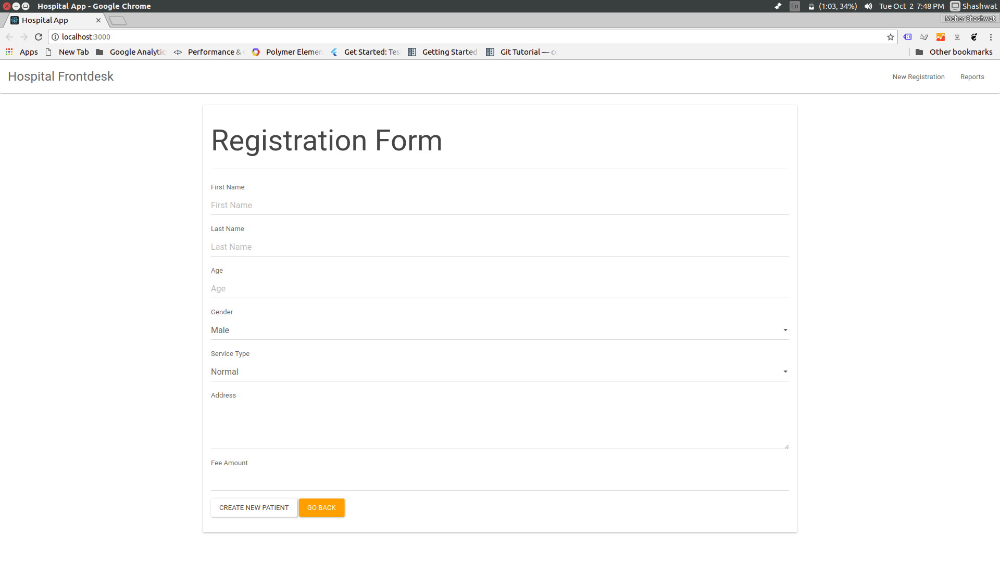

# Hospital management application in React.js and json-server to serve API's
Still under work. 
Bug : refresh page (`ctrl+R`) after login to refresh Navbar.
## Running instructions
* Run `npm install` to install dependencies.
* Run `json-server --watch db.json --port 3001` 
* On a separate terminal, run `npm start` or `yarn start`(if you have yarn) to start the application.

## Patient registration screen-

